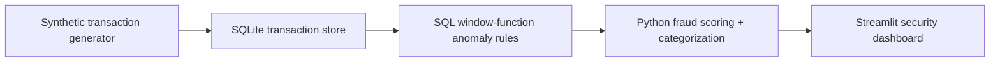

# FraudStream Command Center

FraudStream is a portfolio-grade project that simulates a real-time fraud detection workflow end to end:

- Python generates streaming fake credit-card transactions.
- SQLite stores the transaction stream.
- SQL window functions detect suspicious temporal patterns.
- Python categorizes fraud types and calculates risk scores.
- Streamlit presents a live analyst dashboard with alerts and geographic hotspots.

## Architecture



## Files

- `simulator.py`: micro-batch transaction stream generator
- `fraud_pipeline/database.py`: SQLite schema and insert/query helpers
- `fraud_pipeline/analytics.py`: SQL anomaly detection plus Python risk scoring
- `fraud_pipeline/dashboard.py`: live Streamlit fraud operations dashboard
- `fraud_pipeline/validate_pipeline.py`: smoke test for ingestion plus analytics
- `dashboard.py`: root Streamlit entrypoint for Streamlit Community Cloud
- `analytics.py`, `database.py`, `simulator.py`, `validate_pipeline.py`: root runtime modules for simple cloud execution
- `sql_rules.md`: explanation of the window-function rules

## What makes it interview-worthy

- It avoids static CSV analysis and instead simulates event streaming.
- It uses advanced SQL window functions, not only basic aggregations.
- It combines data engineering, analytics engineering, and product thinking.
- It produces explainable outputs: each flagged row includes triggered rules and a risk score.

## Fraud patterns covered

- Impossible travel: same card used in different cities within one hour
- Velocity spike: four or more transactions in 15 minutes
- Spend anomaly: amount far above that card's rolling baseline
- Merchant burst: repeated usage at the same merchant in a short window
- Cross-border anomaly: transaction outside home country
- Device takeover risk: new online device appears shortly after recent usage
- Channel switch anomaly: rapid shift from in-person to online or vice versa

## Run it

1. Install dependencies:

```powershell
python -m pip install -r requirements.txt
```

2. Start the transaction simulator:

```powershell
python -m fraud_pipeline.simulator --batch-size 10 --sleep-seconds 2
```

3. In a second terminal, launch the dashboard:

```powershell
python -m streamlit run dashboard.py
```

4. Optionally run the smoke test:

```powershell
python -m fraud_pipeline.validate_pipeline
```

## This machine's setup note

This workspace now has a project-local dependency directory at `.deps`. If your default Python environment does not automatically see those packages, use the helper scripts:

```powershell
powershell -ExecutionPolicy Bypass -File .\run_dashboard.ps1
powershell -ExecutionPolicy Bypass -File .\run_validate.ps1
```

## Suggested interview walkthrough

1. Start with the simulator and explain that the project mimics streaming using micro-batches.
2. Show the SQL rules and point out the use of `LAG`, rolling `COUNT`, rolling `AVG`, and `ROW_NUMBER`.
3. Open the dashboard and explain how multiple rules combine into a fraud type and risk score.
4. Close by describing how you would scale the same design to Kafka, dbt, Airflow, and a warehouse.

## Streamlit Cloud

If you deploy on Streamlit Community Cloud, point the app to:

- Main file path: `dashboard.py`
- Branch: `main`

The repo root contains deployable runtime modules so Streamlit Community Cloud can run `dashboard.py` directly without relying on package-path resolution.

## Resume bullet ideas

- Built a real-time fraud analytics pipeline using Python, SQLite, SQL window functions, and Streamlit to detect anomalous card activity.
- Designed rolling anomaly rules for impossible travel, velocity spikes, spend outliers, and account takeover signals with explainable risk scoring.
- Developed a live security dashboard with alert feeds, fraud typology charts, and geographic hotspot monitoring.
